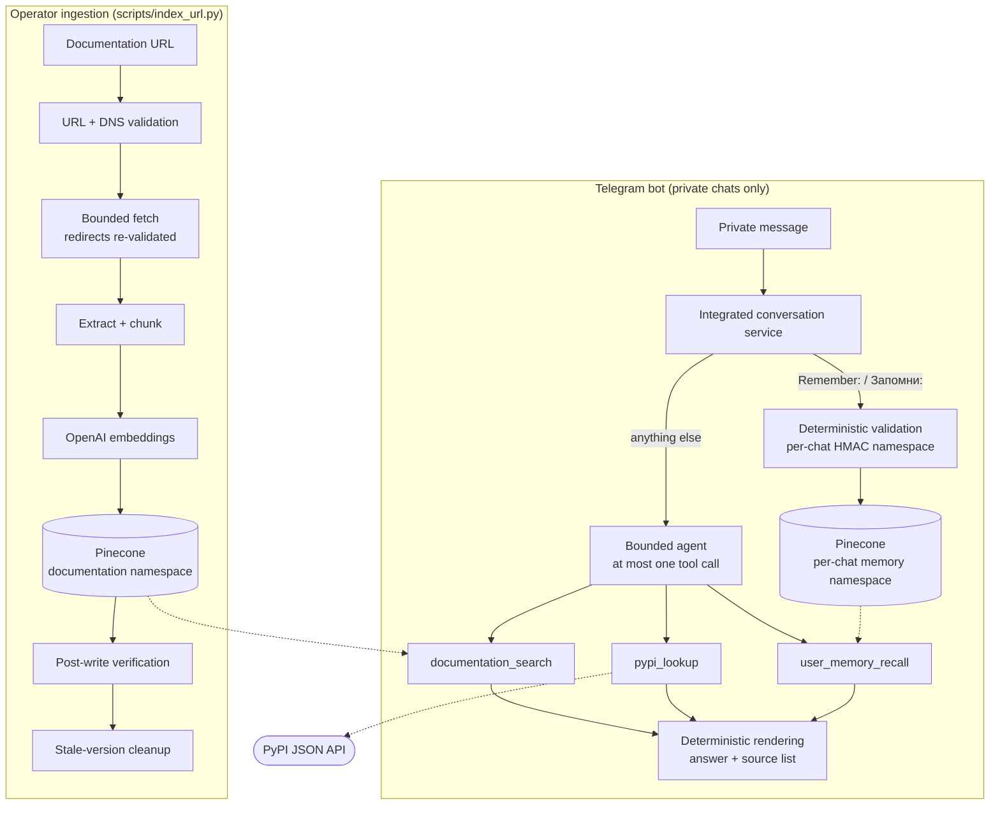

# AI Docs RAG Agent

[](https://github.com/eliv1982/ai-docs-rag-agent/actions/workflows/ci.yml)

A Telegram assistant for **technical documentation you index yourself**: SSRF-aware URL
ingestion into Pinecone, grounded RAG answers with deterministically generated source links,
and a bounded, read-only tool-calling agent behind a private-chat Telegram interface.

```
documentation URL → SSRF-aware fetch → deterministic Pinecone lifecycle
   → grounded RAG → bounded tool-calling agent → Telegram (private chats)
```

It is a portfolio project, not a hosted service or a generic chatbot. The bot answers from the
documentation in your own index, looks up current PyPI metadata, and (secondarily) recalls
preferences a user explicitly asked it to remember. Everything else gets a fixed fallback.

## What makes it distinctive

- **Safe ingestion.** Operators index public documentation URLs through a fetcher that
  validates URL and DNS answers, re-validates every redirect, and bounds response size.
  Telegram users have no way to make the bot fetch a URL.
- **Deterministic document lifecycle.** Document and chunk IDs are SHA-256 derived, re-indexing
  is idempotent, writes are verified by fetching the IDs back, and stale versions of the same
  page are removed afterwards.
- **Grounding with an honest contract.** Retrieval is filtered to documentation records,
  scored against a configurable relevance threshold, and answered from the retrieved context.
  With no useful evidence no answer is generated and a fixed fallback is returned. Source
  links come from stored metadata, never from model output.
- **A bounded agent, enforced in code.** Three read-only tools, at most one tool execution
  per request, and parallel multi-tool output is rejected deterministically rather than
  trusted to the prompt.
- **Privacy-minded memory and logging.** Long-term memory is explicit-write only, namespaced per
  chat by an HMAC of the chat ID, and logs carry only keyed, truncated session hashes.
- **Tested without credentials.** The whole suite runs offline against fakes; CI runs lint and
  the tests on Python 3.11 and 3.12 with no secrets.

## Architecture



| Module (`src/ai_docs_agent/`) | Responsibility |
| --- | --- |
| `url_ingestion.py` | URL/DNS validation, bounded fetch, HTML extraction, chunking |
| `indexing.py`, `pinecone_store.py` | Embeddings, batched upsert, verification, stale-version cleanup |
| `retrieval.py`, `agent.py` | Filtered semantic search; grounded answer generation with fallback |
| `langchain_agent.py` | Tool-calling agent (LangChain `create_agent`) with the one-call guard |
| `user_memory.py` | Explicit-write long-term memory: command parser, HMAC identity, dedup, recall |
| `integrated_agent.py` | The production conversation service: remember pre-routing, agent, short-term history |
| `telegram_bot.py` | Private-chat handlers over the integrated service; message splitting |
| `memory.py` | Short-term, process-local per-chat history (last 10 messages) |
| `pypi.py`, `config.py`, `observability.py` | PyPI JSON lookup; typed settings; privacy-safe logging helpers |

## Core capabilities

- **Ingest** a documentation page: fetch → extract text (code blocks keep their indentation) →
  chunk → embed → upsert → verify → clean up stale versions. Operator CLI only.
- **Retrieve** with a typed, read-only search restricted to `kind == "documentation_chunk"`.
- **Answer** from retrieved chunks. One bounded contextual retry is made when the direct query
  finds nothing and the chat has history (for example, resolving an alias the user defined
  earlier in the same dialogue).
- **Look up PyPI** package metadata (latest version, summary, `requires_python`, links) over
  the PyPI JSON API.
- **Remember** an explicit user preference (`Запомни: …` or `Remember: …`) and **recall** it
  later when the user asks about it.
- **Converse over Telegram** in private chats: `/start`, `/reset`, and free-text questions.
  The bot's own messages and fallbacks are in Russian.

## Safety and trust boundaries

**Ingestion (SSRF boundary).** Ingestion is operator-only and applies these checks:

- only `http`/`https`; URLs with embedded credentials are rejected;
- `localhost` and `*.localhost` are rejected, with hostnames normalized (case, trailing dots);
- every DNS answer for the host must be a globally routable address, so loopback, private,
  link-local (including cloud metadata addresses), CGNAT, multicast and reserved ranges are
  rejected; IPv4-mapped IPv6 is judged by the embedded IPv4 address;
- redirects are followed manually (up to `URL_MAX_REDIRECTS`) and each hop goes through the
  full URL/DNS validation again;
- response size is bounded by `Content-Length` and by the bytes actually streamed, and only
  `text/html` / `application/xhtml+xml` bodies are accepted.

This is best-effort protection, not a guarantee: DNS is resolved once for validation and again
by the HTTP client when it connects, so a DNS-rebinding race between the two (TOCTOU) is
possible. Where that matters, add network egress restrictions around the ingestion host.

**Grounded answers.** What the code guarantees, and what it does not:

| Guaranteed by code | Not guaranteed |
| --- | --- |
| Search is filtered by documentation `kind`; chunks scoring below `RETRIEVAL_SCORE_THRESHOLD` (default `0.25`) are dropped | The threshold is not calibrated to a particular corpus |
| No chunk passes the threshold ⇒ fixed fallback (Russian: "В базе знаний не найдено достаточно информации…") and no answer is generated | Passing the threshold means "similar enough", not "answers the question" |
| Source titles/URLs are built from chunk metadata and de-duplicated by URL | Sources are document-level, not claim-level citations |
| The prompt tells the model to answer only from the retrieved context and to treat chunks and history as untrusted data | The answer text is model-generated and is **not** verified claim by claim; the model can still add an unsupported detail |

**Agent boundary.** The Telegram runtime exposes three read-only tools: `documentation_search`,
`pypi_lookup` and `user_memory_recall`. At most one tool runs per request: parallel tool calls
are disabled at the provider and, if a response still contains several, the whole step is
discarded and a fixed fallback is returned without running any of them. The tool result is
rendered directly, with no second model pass, so package versions and source URLs cannot be
rewritten by the model. No tool fetches arbitrary URLs, writes memory or touches the index. In
the Telegram flow, a model reply produced without any tool call is replaced by the fixed
no-context fallback, so the bot does not answer from the model's general knowledge.

**Telegram boundary.** Only new messages in **private chats** are handled; group, supergroup
and channel updates and edited messages are ignored. Each chat is isolated by `str(chat_id)`.
Users cannot choose namespaces, `top_k`, models or filters.

**Memory.** Long-term memory is written only by the deterministic `Запомни:` / `Remember:`
command, never by the model and never from ordinary messages. The raw chat ID is never stored;
each chat gets a Pinecone namespace derived from `HMAC-SHA256(USER_MEMORY_HASH_SECRET, chat_id)`.
Recalled memory is labeled as personal memory, not presented as documentation. `/reset` clears
only the short-term context; saved preferences stay. The agent has no memory-write tool.

**Logging.** Request logs carry a 12-character keyed session hash, lengths, tool names, counts
and outcome categories. Question text, memory text, raw chat IDs, namespaces and secrets are not
logged. `USER_MEMORY_HASH_SECRET` also keys the session hash, using a domain-separated HMAC
input, so the same secret protects both memory identity and log identifiers.

## Quick start

Requires **Python ≥ 3.11**.

POSIX shell:

```bash
git clone https://github.com/eliv1982/ai-docs-rag-agent.git
cd ai-docs-rag-agent
python -m venv .venv
source .venv/bin/activate
pip install -e ".[dev]"
```

Windows PowerShell:

```powershell
git clone https://github.com/eliv1982/ai-docs-rag-agent.git
cd ai-docs-rag-agent
python -m venv .venv
.venv\Scripts\Activate.ps1
pip install -e ".[dev]"
```

Verify offline (no network, no keys):

```bash
python -m pip check
ruff check src tests scripts
pytest -q
```

Then try the [keyless demos](#keyless-demos). Configure live integrations only when you want
to index documentation or run the bot.

## Keyless demos

These need **no OpenAI, Pinecone or Telegram credentials** and no `.env` file.

```bash
# PyPI lookup — one read-only request to the PyPI JSON API (needs internet)
python scripts/pypi_lookup.py httpx

# URL preview — fetch, extract and chunk one page without embedding or storing anything
# (needs internet; use any public documentation page)
python scripts/url_preview.py "https://developers.openai.com/api/docs/guides/embeddings"
```

The safety checks can be seen without any network traffic, because these are rejected before a
request is made:

```bash
python scripts/url_preview.py http://127.0.0.1/                       # disallowed address
python scripts/url_preview.py http://169.254.169.254/latest/meta-data/ # link-local metadata IP
python scripts/url_preview.py file:///etc/passwd                      # unsupported scheme
python scripts/pypi_lookup.py "../etc"                                # invalid package name
```

`python scripts/pinecone_smoke_test.py` is **not** keyless: it creates an embedding and writes
and deletes a test vector, so it needs OpenAI and Pinecone configuration.

## Live configuration

Copy the template and fill in your own values; `.env` is git-ignored and must never be committed.

```bash
cp .env.example .env              # PowerShell: Copy-Item .env.example .env
```

Each command validates only the settings it uses, and error messages name the variable but never
print its value. Pinecone's index must already exist with a matching dimension (1536 for the
default embedding model) and `cosine` metric, or set `PINECONE_CREATE_IF_MISSING=true` to have a
serverless index created.

| Command | Required variables |
| --- | --- |
| `url_preview.py`, `pypi_lookup.py`, `smoke_test.py` | none |
| `pinecone_smoke_test.py`, `index_url.py`, `search_query.py` | `OPENAI_API_KEY`, `PINECONE_API_KEY` |
| `ask_docs.py`, `ask_agent.py` | the above + `OPENAI_CHAT_MODEL` |
| `user_memory.py` | `OPENAI_API_KEY`, `PINECONE_API_KEY`, `USER_MEMORY_HASH_SECRET` |
| `run_telegram_bot.py` | all of the above + `TELEGRAM_BOT_TOKEN` |

| Group | Variable | Default | Notes |
| --- | --- | --- | --- |
| OpenAI | `OPENAI_API_KEY` | — | Secret. Needed wherever embeddings or chat are used. |
| | `OPENAI_CHAT_MODEL` | — (`.env.example`: `gpt-4o-mini`) | Required for answering, the agent and the bot. |
| | `OPENAI_EMBEDDING_MODEL` | `text-embedding-3-small` | Must match the index dimension. |
| | `OPENAI_BASE_URL` | unset | Optional endpoint override; blank means the default. |
| | `OPENAI_TIMEOUT_SECONDS` | `60` | Per-request timeout for every OpenAI client; must be > 0. |
| Pinecone | `PINECONE_API_KEY` | — | Secret. |
| | `PINECONE_INDEX_NAME` | `ai-docs-rag-agent` | |
| | `PINECONE_DOCUMENTS_NAMESPACE` | `documentation` | Namespace for indexed documentation. |
| | `PINECONE_CREATE_IF_MISSING` | `false` | When `true`, creates a serverless index using the next four settings. |
| | `PINECONE_CLOUD` / `PINECONE_REGION` | `aws` / `us-east-1` | Used only when creating an index. |
| | `PINECONE_DIMENSION` / `PINECONE_METRIC` | `1536` / `cosine` | Only `cosine` is supported. |
| | `PINECONE_SMOKE_*` | see `.env.example` | Namespace and timing for the live smoke test. |
| Retrieval | `RETRIEVAL_TOP_K` | `5` | 1–50. |
| | `RETRIEVAL_SCORE_THRESHOLD` | `0.25` | 0.0–1.0 cosine relevance gate for documentation; not re-calibrated. |
| URL fetch | `URL_FETCH_TIMEOUT_SECONDS` | `15` | |
| | `URL_MAX_RESPONSE_BYTES` | `2000000` | Hard cap on the response body. |
| | `URL_MAX_REDIRECTS` | `5` | 0–10; each hop is re-validated. |
| | `URL_MIN_TEXT_CHARS` | `200` | Pages with less extracted text are rejected. |
| | `URL_USER_AGENT` | `ai-docs-rag-agent/0.1` | |
| | `CHUNK_SIZE` / `CHUNK_OVERLAP` | `1200` / `200` | Overlap must be smaller than the chunk size. |
| Indexing | `EMBEDDING_BATCH_SIZE`, `PINECONE_UPSERT_BATCH_SIZE`, `PINECONE_FETCH_BATCH_SIZE` | `64`, `100`, `500` | Fetch batch ≤ 1000. |
| | `PINECONE_INDEX_VERIFY_TIMEOUT_SECONDS`, `PINECONE_INDEX_VERIFY_POLL_INTERVAL_SECONDS` | `30`, `1` | Bounded post-write verification. |
| | `PINECONE_REPLACE_OLD_SOURCE_VERSIONS` | `true` | Delete stale versions of the same page after a verified write. |
| PyPI | `PYPI_BASE_URL`, `PYPI_TIMEOUT_SECONDS` | `https://pypi.org`, `10` | No credentials needed. |
| Telegram | `TELEGRAM_BOT_TOKEN` | — | Secret. Required only for the bot. |
| User memory | `USER_MEMORY_HASH_SECRET` | — | Secret; use a long random value, not a reused key. Derives per-chat memory namespaces **and** keys the session hashes in logs. Rotating it orphans existing memory and changes log identifiers. |
| | `USER_MEMORY_NAMESPACE_PREFIX` | `user-memory` | Must differ from the documentation namespace. |
| | `USER_MEMORY_TOP_K` / `USER_MEMORY_SCORE_THRESHOLD` | `5` / `0.35` | Recall limit and cosine threshold (not re-calibrated). |
| | `USER_MEMORY_MAX_STATEMENT_LENGTH` | `500` | 1–4000 characters. |

## Usage

```bash
# 1. Index documentation (operator; needs OpenAI + Pinecone)
python scripts/index_url.py "https://developers.openai.com/api/docs/guides/embeddings"

# 2. Inspect retrieval, then ask a grounded question (read-only)
python scripts/search_query.py "what are embeddings?" --top-k 3
python scripts/ask_docs.py "what are embeddings?"

# 3. Ask the tool-calling agent (documentation + PyPI; the CLI agent has no memory tool)
python scripts/ask_agent.py "What is the latest version of httpx on PyPI?"

# 4. Run the Telegram bot (long polling; Ctrl+C to stop)
python scripts/run_telegram_bot.py

# Optional: explicit long-term memory from the command line
python scripts/user_memory.py remember demo-user "In examples I prefer httpx."
python scripts/user_memory.py recall demo-user "Which HTTP library do I prefer?"
```

`index_url.py` exits `0` on success, `2` if the page was indexed and verified but stale-version
cleanup failed, and `1` on any other error.

In Telegram (private chat with your bot):

| Message | Effect |
| --- | --- |
| `/start` | Short introduction and what the bot can do |
| `/reset` | Clears this chat's short-term context; saved preferences are kept |
| `Запомни: в примерах я предпочитаю httpx.` | Explicitly stores a preference (`Remember: …` also works) |
| Any other text | Agent chooses documentation search, PyPI lookup, or preference recall |

## Testing and CI

- **Offline tests** (`pytest -q`) need no network, real DNS or credentials: HTTP is faked with
  `httpx.MockTransport`, DNS through an injectable resolver, and OpenAI/Pinecone/Telegram
  through fakes and scripted tool-calling models.
- **Lint:** `ruff check src tests scripts`.
- **CI:** [GitHub Actions](.github/workflows/ci.yml) installs the package with its dev extras and
  runs `pip check`, Ruff and pytest on **Python 3.11 and 3.12** for pushes to `main` and pull
  requests. It uses no secrets and makes no live calls.
- Live scripts (`index_url.py`, `ask_*.py`, the smoke test, the bot) are run manually and are not
  part of the automated suite.

## Evidence

[`deliverables/evidence/final_acceptance/`](deliverables/evidence/final_acceptance/) holds nine
screenshots from a manual live Telegram run on 2026-07-04: `/start`, a documentation answer
with a source, PyPI lookup, explicit remember and recall, memory surviving `/reset`, a
short-term alias being forgotten after `/reset`, and an out-of-scope refusal. See the
[evidence index](deliverables/evidence/final_acceptance/README.md).

This is **historical acceptance evidence, not current-state verification.** It predates the
October 2026 hardening commits. What verifies the current code is the test suite and CI above.

## Known limitations and design boundaries

- **Grounding is best-effort.** Answers are model-generated from retrieved context without
  claim-level verification; sources are page-level. There is no reranking (Pinecone's order is
  used), and the two score thresholds are historical defaults rather than calibrated values.
- **Single process, in-memory short-term history.** The last 10 messages per chat are kept in
  process memory, are lost on restart, and rely on updates being handled one at a time (no
  locking). Run one bot instance.
- **No access control or rate limiting.** Anyone who can message the bot in a private chat can
  use it, and each request spends OpenAI and Pinecone quota.
- **Tool choice is probabilistic.** The model may pick a suboptimal tool; the one-call limit means
  no multi-tool answers (for example, documentation plus PyPI in one reply). Harmless small
  talk with no tool call also receives the fixed fallback.
- **Memory is minimal.** No listing or deletion from chat; deduplication is exact after
  normalization, not semantic; rotating `USER_MEMORY_HASH_SECRET` strands existing records.
- **Indexing is operator-driven and not transactional.** No list/delete admin commands, no
  distributed locking between concurrent writers of the same URL, a failed multi-batch upsert can
  leave partial writes (re-running is safe because IDs are deterministic), and only static HTML
  pages are supported (no JavaScript rendering or PDFs).
- **SSRF protection is best-effort** (see the TOCTOU note above).
- **Telegram:** text messages in private chats only; no streaming; user-facing strings are Russian.

## Project status and possible next steps

The core pipeline is complete and covered by tests; the repository is maintained as a
portfolio artifact. Ideas that are explicitly *not* commitments:

- retrieval evaluation set to calibrate thresholds and compare chunking settings;
- document list/delete admin CLI;
- scheduled or sitemap-based ingestion;
- memory inspection and deletion;
- persistent short-term history;
- optional access control and rate limiting;
- optional hosted deployment.

## License

[MIT](LICENSE) © 2026 eliv1982
